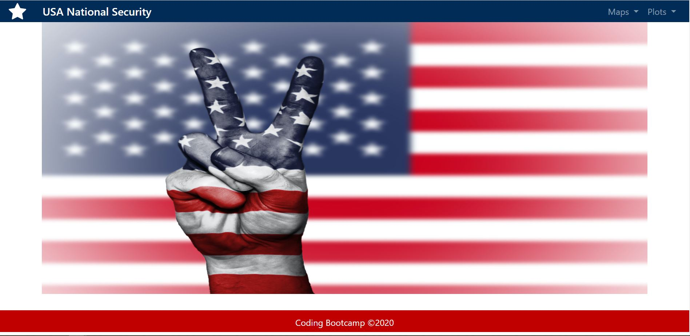
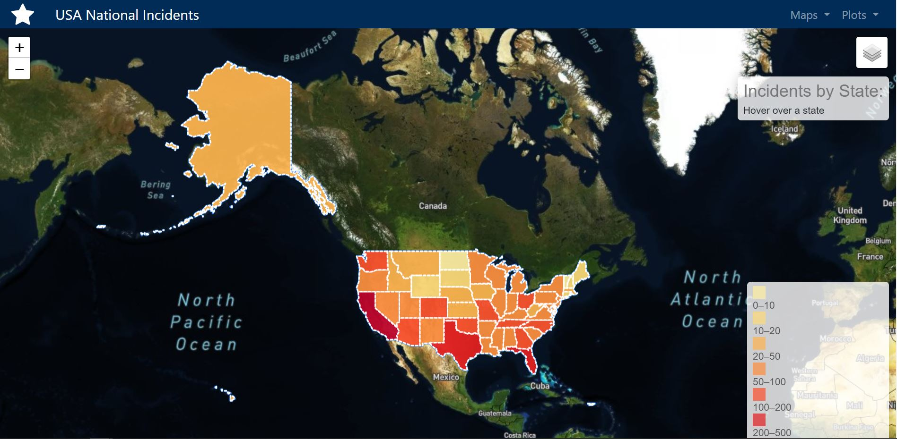
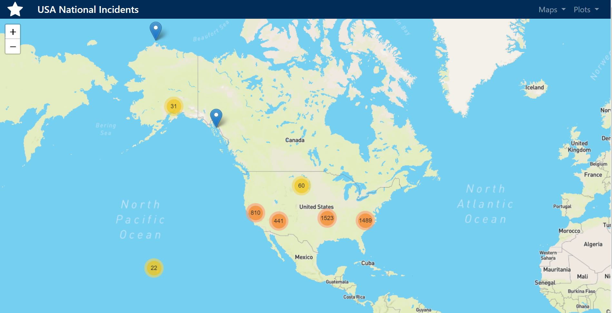
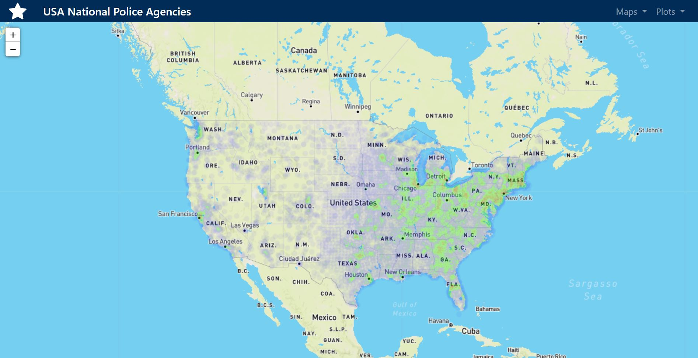
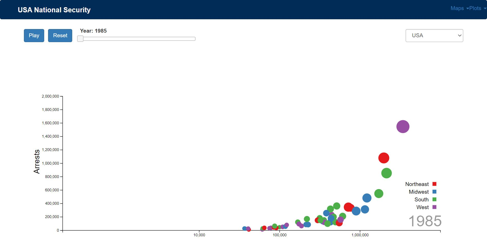
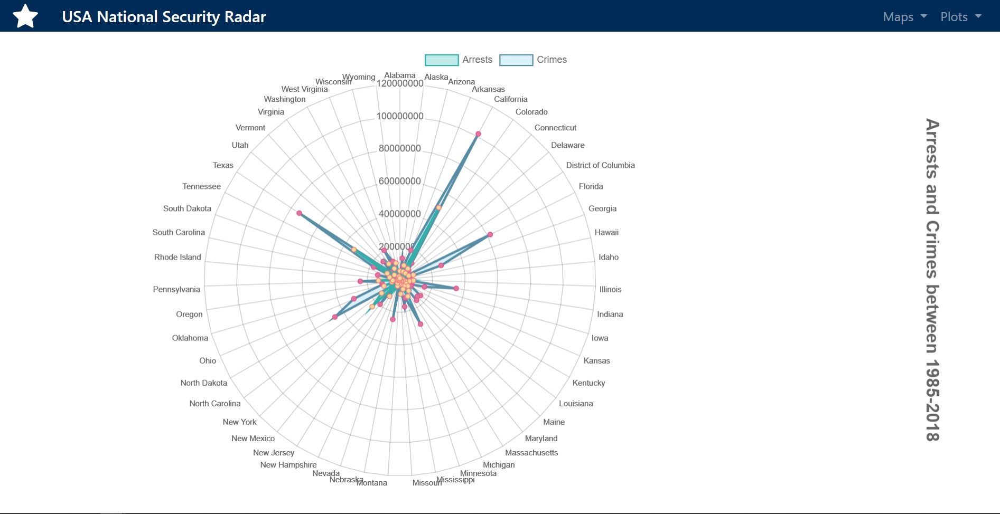
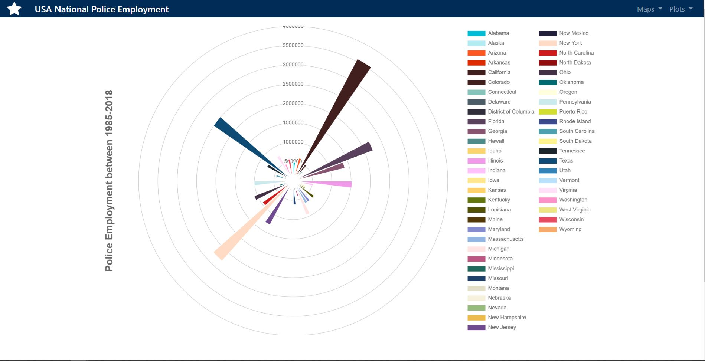
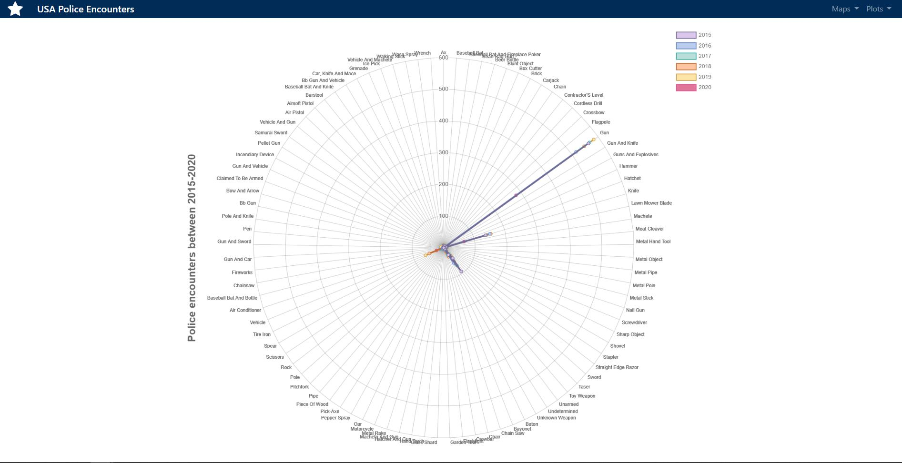
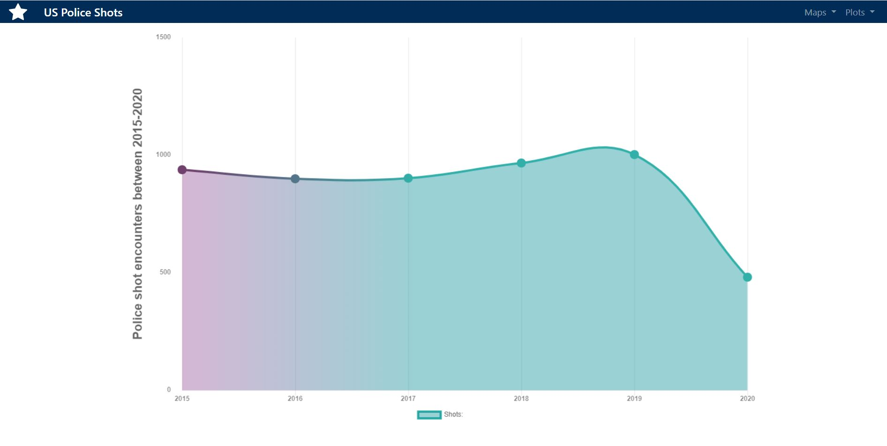
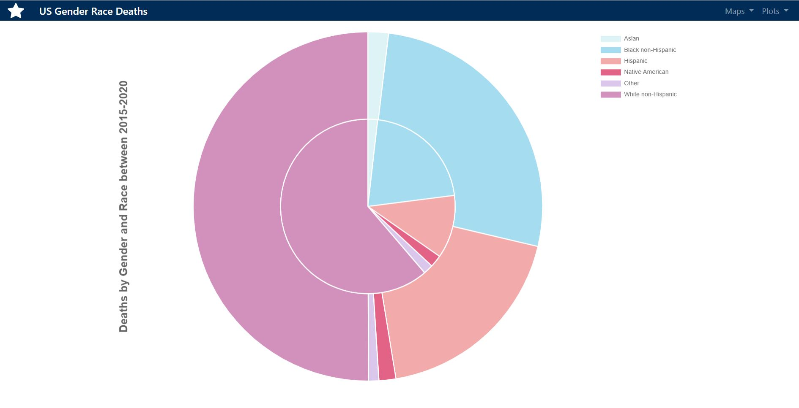

# Team project National Security in USA

**Project Description:** Data Science analysis of the national security evolution regarding incidents, crimes, arrests, police agencies and employment in the USA.

**Web page:** In the following link [Page](https://odindeltoro.github.io/Team-project-USA-police-and-crime/USADataGov/Web%20design/templates/index.html)

***Team:*** Abraham Calderon, Bernardo Jardon, Martin Jaramillo and Odin Del Toro.

**Objective:** Derived from the current situation of social disrupt and encounter police cases in USA, the analysis purpose is to evaluate the evolution of the related factors that contribute to the disruptions.

**Topics and research questions:**

* Police shot incidents.

* Police agencies.

* Police employment.

* Crimes.

* Arrests.

***Dataset:*** The data is extracted from Kaggle in the following link 
[Police shootings](https://www.kaggle.com/mrmorj/data-police-shootings)

***Dataset premises:***  
* Acummulated data from 01/01/2015 until 16/06/2020.

***FBI API:*** The data is extracted from the US Government Data FBI API in the following link
[FBI](https://api.data.gov/docs/fbi/)

***API premises:***  
* Acummulated data from 1985 until 2018.

 Summary statistics and data visualizations created using Python (Pandas, Flask, SQLAlchemy, PyMongo) and Javascript (D3.js, Leaflet.js, jquery, chart.js).
 Stored data in databases (PostgreSQL, MongoDB) and build website (HTML/CSS, Bootstrap).

 
 
 
 
 
 
 
 
 
 
